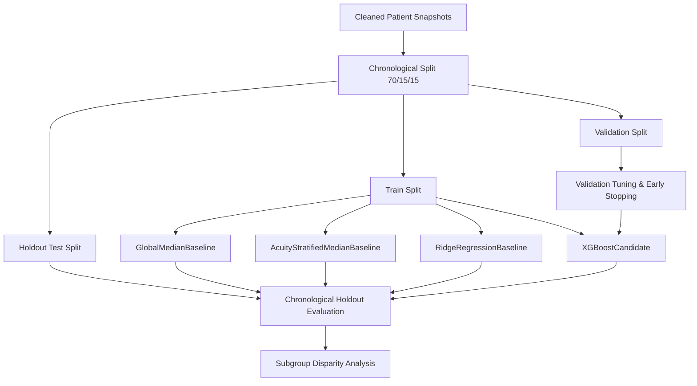

# QueueMind Methodology & Analytical Design

## 1. Problem Formulation

Emergency Departments (ED) operate as dynamic, stochastic queuing networks characterized by non-stationary arrival spikes, heterogeneous patient acuity, and fluctuating downstream bed capacity. QueueMind focuses on two operational challenges:

1. **Patient Journey Remaining Duration Regression**:
   Given a patient's current status and departmental operational load at snapshot timestamp $T_{\text{snapshot}}$, predict the remaining duration $Y$ until physical disposition (discharge or inpatient transfer):
   $$Y = T_{\text{out}} - T_{\text{snapshot}}$$
   where $T_{\text{out}}$ is the departure timestamp and $T_{\text{in}} \le T_{\text{snapshot}} < T_{\text{out}}$.

2. **Congestion & Flow Load Forecasting**:
   Forecast active ED census $C_{T + \Delta t}$ and congestion severity tiers (Low, Moderate, High, Critical) across forward operational horizons $\Delta t \in \{30\text{m}, 60\text{m}, 120\text{m}\}$.

---

## 2. Dataset Realities & Honest Scope Definition

### 2.1 Observability Boundary

QueueMind strictly enforces a dataset observability boundary based on the empirical schema of MIMIC-IV-ED. Unobserved clinical workflow milestones are not modeled or claimed.

| Operational Quantity | Available in MIMIC-IV-ED? | Source Table / Fields | Timestamp Quality | Can Be Modeled? |
| :--- | :---: | :--- | :--- | :---: |
| ED Arrival / Registration Time | **Yes** | `edstays.intime` | Minute-level clinical recording | **Yes** (Arrival event) |
| ED Departure Time | **Yes** | `edstays.outtime` | Minute-level clinical recording | **Yes** (Target-side only) |
| Total ED Length of Stay | **Yes** | `outtime - intime` | Derived from arrival & departure | **Yes** (Target-side only) |
| Active Patient Census at $T$ | **Yes** | `edstays` ($T_{\text{in}} \le T < T_{\text{out}}$) | Reconstructed point-in-time state | **Yes** (Feature & Future Target) |
| Rolling Arrivals (15m, 30m, 60m, 120m) | **Yes** | `edstays.intime` | Exact event counts $\le T$ | **Yes** (Input Feature) |
| Rolling Departures (15m, 30m, 60m, 120m) | **Yes** | `edstays.outtime` | Exact completed departures $\le T$ | **Yes** (Input Feature) |
| Net Flow Velocity ($\Delta = \text{Arr} - \text{Dep}$) | **Yes** | Derived | Exact count differences $\le T$ | **Yes** (Input Feature) |
| Active Triage Acuity Composition | **Yes** | `edstays` + `triage.acuity` | Point-in-time join on active stays | **Yes** (Input Feature) |
| Door-to-Triage Wait Time | **No** | None | Not recorded in MIMIC-IV-ED (intime is intake) | **No** (Do not assume/model) |
| Door-to-Doctor Wait Time | **No** | None | No physician assignment timestamp exists | **No** (Do not assume/model) |
| Door-to-Bed Wait Time | **No** | None | No physical bed assignment timestamp exists | **No** (Do not assume/model) |
| Nurse Assignment Time | **No** | None | No nursing assignment timestamp exists | **No** (Do not assume/model) |
| Diagnostic Order Turnaround Time | **No** | None | Standalone MIMIC-IV-ED lacks lab turnaround | **No** (Do not assume/model) |
| Boarding Duration (Admit Decision to Depart) | **Partial/Proxy** | `edstays.disposition` | `disposition == 'ADMITTED'`, no boarding order stamp | Only as outcome label |

### 2.2 Scope Boundary: Flow Intelligence vs. "Doctor Wait Time"
A critical design requirement for QueueMind is maintaining absolute fidelity to the source data:
- **No Direct "Doctor-at-Bedside" Milestone**: The public MIMIC-IV-ED dataset provides registration (`intime`), physical departure (`outtime`), triage assessment, periodic nursing vitals, and medication administration records. It does **not** record a standardized, reliable physician initial evaluation timestamp for every encounter.
- **QueueMind's Honest Formulation**: QueueMind explicitly targets **total remaining patient journey duration** and **departmental congestion intelligence**.
- Under no circumstances does QueueMind fabricate intermediate timestamps or claim to predict an unrecorded clinical wait milestone.
- **Non-Diagnostic Nature**: QueueMind is purely an operational logistics and resource management system. It does not diagnose medical conditions, recommend medical treatments, or alter clinical triage prioritization.

---

## 3. Data Cleaning & Physiological Plausibility Philosophy

Data cleaning in emergency medicine must balance signal preservation with the rejection of sensor disconnects and typographical errors. QueueMind adopts a **non-destructive plausibility filtering** approach:

### 3.1 Physiological Limits
Rather than deleting entire patient encounters when an anomalous vital sign occurs, values strictly outside physiological survival limits are converted to `NaN`. This permits tree-based models and downstream imputation pipelines to learn from valid co-occurring variables.

| Physiological Metric | Valid Plausible Range | Rationale & Clinical Standard |
|---|---|---|
| **Heart Rate** | 20.0 – 260.0 bpm | Extreme bradycardia/tachycardia boundaries; readings $\le 10$ or $> 300$ represent lead detachment or artifact. |
| **Systolic BP** | 40.0 – 260.0 mmHg | Profound cardiogenic shock to severe hypertensive crisis; readings outside represent cuff transducer failure. |
| **Diastolic BP** | 20.0 – 160.0 mmHg | Physiologically plausible limits; values must satisfy $\text{SBP} \ge \text{DBP}$. |
| **Respiratory Rate**| 4.0 – 60.0 breaths/min | Extreme hypoventilation to tachypnea; values $\le 2$ represent apnea requiring intervention. |
| **Pulse Oximetry ($O_2$)** | 50.0% – 100.0% | Severe hypoxia to ambient ceiling; readings $< 50\%$ represent sensor displacement. |
| **Temperature** | 85.0°F – 108.0°F | Severe hypothermia to hyperpyrexia ($29.4^\circ\text{C} - 42.2^\circ\text{C}$). |
| **ESI Acuity** | 1 to 5 | Emergency Severity Index 1 (Immediate/Resuscitation) to 5 (Non-urgent). |

### 3.2 Pain Score Standardization
MIMIC-IV-ED records pain as heterogeneous text entries, numeric ratings, qualitative notes (`severe`, `moderate`, `mild`), and non-numeric entries (`unable to assess`, `uta`, `denies`). The cleaner parses these into standard numeric floats on a $[0.0, 10.0]$ scale while treating unparseable clinical entries as `NaN`.

---

## 4. Preventing Data Leakage

Data leakage is the single greatest risk in retrospective healthcare ML. QueueMind enforces four structural safeguards:

### 4.1 Chronological Split Strategy
Random patient-level cross-validation or train/test splitting is strictly prohibited:
- Because multiple patients occupy the department concurrently, random splits allow future system states (e.g. tomorrow's congestion) to contaminate historical training representations.
- **Enforcement**: Strict chronological partitioning:
  - Historical Period (70%) $\rightarrow$ **Train Set**
  - Intermediate Period (15%) $\rightarrow$ **Validation Set**
  - Latest Chronological Period (15%) $\rightarrow$ **Holdout Test Set**
- **Mathematical Non-Overlapping Verification**:
  $$\max(T_{\text{train}}) \le \min(T_{\text{val}}) \le \max(T_{\text{val}}) \le \min(T_{\text{test}})$$

### 4.2 Hard Point-in-Time Information Boundary
For any snapshot taken at $T_{\text{snapshot}}$:
$$t_{\text{event}} \le T_{\text{snapshot}}$$
- Longitudinal vitals recorded at $charttime > T_{\text{snapshot}}$ are strictly filtered out.
- Encounters arriving at $intime > T_{\text{snapshot}}$ are invisible to snapshot calculations.
- Departures occurring at $outtime > T_{\text{snapshot}}$ are **never** included in historical departure counts.
- **Invariance Guarantee**: Altering or adding events occurring at $t > T_{\text{snapshot}}$ yields an identical feature vector at $T_{\text{snapshot}}$ (verified by unit test `test_future_event_leakage_invariance`).

### 4.3 Strict Target-Side Segregation
- The target variable `remaining_time_minutes` is derived from $T_{\text{out}} - T_{\text{snapshot}}$.
- Prohibited target fields (`stay_id`, `snapshot_time`, `intime`, `outtime`, `disposition`, `remaining_time_minutes`) are strictly isolated and barred from entering feature matrices $X$ (enforced by `PROHIBITED_FEATURE_COLUMNS` and verified by unit test `test_xgboost_rejects_leaked_target_columns`).

### 4.4 Training-Only Preprocessing Fit
- All transformers (imputers, standard scalers, one-hot encoders) are `fit` strictly on training split data.
- Encoders handle unknown or novel categories gracefully (`handle_unknown='ignore'`) without causing execution failures or retroactively leaking categories into training.

---

## 5. Model Input Contract

The feature matrix $X$ fed to candidate models adheres strictly to point-in-time constraints:

### 5.1 Permitted Features
1. **Demographics & Triage**:
   - `age`: Continuous integer $[18, 120]$.
   - `gender`: Categorical (`M`, `F`).
   - `acuity`: Ordinal integer $[1, 5]$.
   - `arrival_transport`: Categorical (`WALK IN`, `AMBULANCE`, `HELICOPTER`, `UNKNOWN`).
   - `chiefcomplaint_category`: Categorical high-level grouping (e.g., `chest_pain`, `abdominal_pain`, `respiratory`, etc.).
2. **Snapshot-Safe Vitals & Clinical Indicators**:
   - Numeric vitals: `heartrate`, `sbp`, `dbp`, `resprate`, `o2sat`, `temperature`, `pain_numeric`.
   - Binary physiological abnormality flags: `is_tachycardic`, `is_bradycardic`, `is_febrile`, `is_hypotensive`, `is_hypertensive`, `is_tachypneic`, `is_hypoxic`.
   - Longitudinal trajectory summaries: `vitals_count`, elapsed time since registration (`elapsed_time_minutes`).
3. **Temporal Dynamics**:
   - Calendar features: `snapshot_hour`, `snapshot_dayofweek`, `snapshot_day`, `snapshot_month`, `snapshot_is_weekend`.
   - Cyclical encodings: $\sin(2\pi \cdot \text{hour} / 24)$, $\cos(2\pi \cdot \text{hour} / 24)$.
   - Operational nursing shifts: `nursing_shift` (`morning`, `evening`, `night`).
4. **Department Congestion & Queue Pressures**:
   - Active ED census: $C(T_{\text{snapshot}})$.
   - Rolling arrivals: `arrivals_last_15m`, `arrivals_last_30m`, `arrivals_last_60m`, `arrivals_last_120m`.
   - Rolling departures: `departures_last_15m`, `departures_last_30m`, `departures_last_60m`, `departures_last_120m`.
   - Net flow rate: $\text{Arrivals}_{60m} - \text{Departures}_{60m}$.
   - Flow velocity ratio: $\text{Arrivals}_{60m} / (\text{Departures}_{60m} + 1)$.
   - Acuity pressure index: Weighted census by resuscitation and high-acuity patient proportions.

### 5.2 Prohibited Features
The following columns are prohibited from entering $X$ under any circumstance:
- `stay_id`, `snapshot_time`: Non-generalizable identifiers.
- `intime`: Absolute historical timestamp.
- `outtime`, `disposition`: Future outcome labels.
- `remaining_time_minutes`, `remaining_time`: Ground-truth prediction target.

---

## 6. Modeling Hierarchy & Implementations

Model development follows an empirical benchmarking ladder from simple operational heuristics to non-linear tree ensembles:

### 6.1 Baseline 1: Global Median Baseline (`GlobalMedianBaseline`)
- **Mechanism**: Calculates the global median of `remaining_time_minutes` across all training encounters:
  $$\hat{Y} = \text{Median}(Y_{\text{train}})$$
- **Role**: Serves as the minimal operational baseline; any ML model must substantially beat this constant predictor.

### 6.2 Baseline 2: Acuity-Stratified Median Baseline (`AcuityStratifiedMedianBaseline`)
- **Mechanism**: Partitions training records by triage acuity $a \in \{1, 2, 3, 4, 5\}$ and predicts group-specific medians:
  $$\hat{Y}(a) = \text{Median}(Y_{\text{train}} \mid \text{acuity} = a)$$
- **Fallback Rule**: If acuity is missing (`NaN`) or an unseen acuity level is encountered at inference time, safely falls back to $\text{Median}(Y_{\text{train}})$.
- **Role**: Standard clinical rule-of-thumb baseline reflecting common triage expectations.

### 6.3 Baseline 3: Regularized Linear Regression (`RidgeRegressionBaseline`)
- **Mechanism**: L2 regularized linear regression (`Ridge(alpha=1.0)`) wrapped with a training-fitted `ColumnTransformer` (median imputation + `StandardScaler` for numerics, most-frequent imputation + `OneHotEncoder` for categoricals).
- **Role**: Linear benchmark isolating whether non-linear tree-based interactions provide empirical gain over additive linear models.

### 6.4 Primary Production Model: XGBoost Regressor (`XGBoostCandidate`)
- **Mechanism**: Gradient boosted decision tree ensemble (`xgboost.XGBRegressor`) parameterized with:
  - `objective="reg:squarederror"`
  - `learning_rate=0.05`
  - `n_estimators=100`
  - `max_depth=5`
  - `subsample=0.8`
  - `colsample_bytree=0.8`
  - `random_state=42`
  - `n_jobs=1` (deterministic execution)
- **Native Missing Value Handling**: Gradient boosting routes samples with missing physiological measurements along optimal split paths natively without requiring artificial imputation.
- **Zero-Floor Constraint**: Because physical ED duration cannot be negative, inference enforces $\hat{Y} = \max(0.0, \hat{Y}_{\text{raw}})$.

---

## 7. Evaluation Framework

### 7.1 Regression Performance Metrics
1. **Mean Absolute Error (MAE)**:
   $$\text{MAE} = \frac{1}{N} \sum_{i=1}^N |y_i - \hat{y}_i|$$
   - **Primary Operational Metric**: Direct physical interpretation in minutes. Hospital administrators and clinical directors immediately understand "on average, predictions are off by $M$ minutes."
2. **Root Mean Squared Error (RMSE)**:
   $$\text{RMSE} = \sqrt{\frac{1}{N} \sum_{i=1}^N (y_i - \hat{y}_i)^2}$$
   - Penalizes extreme duration miscalculations heavily.
3. **Median Absolute Error (MedAE)**:
   $$\text{MedAE} = \text{Median}(|y_i - \hat{y}_i|)$$
   - Resilient against extreme ED length-of-stay outliers (e.g., complex psychiatric boarding or delayed transport cases lasting $>48$ hours).
4. **Coefficient of Determination ($R^2$)**:
   $$R^2 = 1 - \frac{\sum (y_i - \hat{y}_i)^2}{\sum (y_i - \bar{y})^2}$$
   - Quantifies proportion of duration variance explained by model features.

### 7.2 Subgroup Disparity Analysis (`evaluate_subgroups`)
Models are evaluated across key operational strata to ensure uniform reliability:
- **Triage Acuity Cohorts**: ESI 1 (immediate resuscitation) through ESI 5 (non-urgent).
- **Nursing Shifts**: Morning (07:00–15:00), Evening (15:00–23:00), Night (23:00–07:00).
- **Arrival Transport**: Ambulance arrivals (higher acuity, distinct boarding workflows) vs. Walk-ins.
- **Fairness & Operational Parity**: Systematically monitors whether prediction error spikes during vulnerable night shifts or for specific patient demographics.

---

## 8. Explainability & Feature Attribution (TreeSHAP)

### 8.1 TreeSHAP Formulation
QueueMind utilizes TreeSHAP (Lundberg et al., Nature Machine Intelligence 2020) to compute exact Shapley values for XGBoost tree ensembles in polynomial time. For an encounter feature vector $x$:
$$f(x) = \phi_0 + \sum_{j=1}^M \phi_j(x)$$
where $\phi_0 = \mathbb{E}[f(X)]$ is the expected baseline duration across the training population, and $\phi_j(x)$ represents the additive contribution (in minutes) of feature $j$.

### 8.2 Human-Readable Feature Aggregation
In the presence of categorical one-hot encoding, raw model outputs contain fragmented dummy variables (e.g. `cat__arrival_transport_AMBULANCE`, `cat__arrival_transport_WALK IN`). Because Shapley values are strictly additive across independent coalition subsets, QueueMind sums dummy attributions belonging to the same clinical or operational covariate:
$$\phi_{\text{arrival\_transport}} = \sum_{v \in \text{Categories}} \phi_{\text{cat\_\_arrival\_transport\_}v}$$
This preserves exact mathematical additivity ($\phi_0 + \sum_{f} \phi_f \approx \hat{y}$) while displaying meaningful clinical factors (`arrival_transport: AMBULANCE`) instead of pipeline artifacts.

### 8.3 Critical Non-Causal Safety Disclaimer
> [!CAUTION]
> **Non-Causal Interpretability Boundary:**
> - SHAP values explain **model sensitivity and conditional mathematical associations** within the retrospective dataset.
> - SHAP values do **NOT** establish causal relationships, clinical etiology, or interventional efficacy.
> - A positive attribution for `active_census` means that higher department volume was mathematically associated with longer remaining duration; it does **NOT** prove that reducing census will causally reduce an individual patient's stay duration by that amount.

---

## 9. Prediction Uncertainty & Conformal Calibration

Point predictions fail to communicate operational volatility and prediction uncertainty. QueueMind implements **Split-Conformal Prediction** (Vovk et al.; Papadopoulos et al.; Angelopoulos & Bates) to produce calibrated prediction intervals.

### 9.1 Chronological Split-Conformal Calibration Protocol
1. **Model Training**: The XGBoost candidate is trained strictly on the historical training set ($T_{\text{train}}$).
2. **Calibration Phase**: The trained model generates predictions $\hat{y}_i$ across the chronological validation set ($T_{\text{val}}$). Absolute residuals are computed:
   $$R_i = |y_i - \hat{y}_i|, \quad \forall i \in \text{Validation Set}$$
   Sorted non-conformity scores: $R_{(1)} \le R_{(2)} \le \dots \le R_{(n)}$.
3. **Finite-Sample Quantile Derivation**: For a desired coverage level $1 - \alpha$ (e.g. 0.90 for 90% coverage), the calibrated cutoff $q_{1-\alpha}$ is:
   $$k = \min\left(n, \lceil (n + 1)(1 - \alpha) \rceil\right) - 1, \quad q_{1-\alpha} = R_{(k)}$$
4. **Test & Inference Prediction Interval**:
   $$\text{Interval}(\hat{y}) = \left[ \max(0.0, \hat{y} - q_{1-\alpha}), \; \hat{y} + q_{1-\alpha} \right]$$
   The lower bound is physically bounded at 0.0 minutes because remaining journey duration cannot be negative.

### 9.2 Statistical Interpretation & Exchangeability Assumptions
- **Marginal Coverage Guarantee**: Under the assumption that validation and test observations are exchangeable, split conformal prediction guarantees that:
  $$P(Y_{\text{test}} \in \text{Interval}(\hat{Y}_{\text{test}})) \ge 1 - \alpha$$
- **No Individual Clinical Probability**: Conformal prediction guarantees **marginal population coverage**, not a subjective 90% certainty for a specific patient encounter.
- **Distribution Shift Vulnerability**: Severe operational shocks (e.g. mass-casualty incidents, novel epidemics, sudden staffing shortages) violate exchangeability and may degrade empirical coverage until the calibrator is recalibrated on recent data.

---

## 10. Department Congestion & Multi-Horizon Load Forecasting

### 10.1 Problem Formulation & Primary Target
To provide operational situational awareness for nursing supervisors and capacity managers, QueueMind forecasts department-level headcount rather than abstract indexes:
$$\text{Target: } C(T + h) = \sum_{i} \mathbf{1}\{ T_{\text{in}, i} \le T + h < T_{\text{out}, i} \}, \quad h \in \{30\text{m}, 60\text{m}, 120\text{m}\}$$
Predicting active census directly:
1. Translates directly into physical bed requirements and staffing ratios.
2. Preserves physical non-negativity ($\hat{C} \ge 0$).
3. Directly answers operational capacity questions across tactical forward planning windows.

### 10.2 Direct Multi-Horizon Architecture
QueueMind employs a **direct multi-step forecasting strategy** rather than recursive single-step autoregression:
- A distinct, dedicated estimator is trained for each horizon $h \in \{30, 60, 120\}$.
- **Advantages**: Eliminates error accumulation inherent to recursive multi-step rollouts and permits horizon-specific feature weighting (e.g. recent 15m arrivals heavily influence 30m forecasts, while diurnal cyclical trends dominate 120m forecasts).

### 10.3 Baseline Benchmarks & ML Models
Before deploying gradient-boosted trees, QueueMind benchmarks ML models against strict operational baselines:
1. **Last-Value (Persistence) Baseline**:
   $$\widehat{C}_{\text{persist}}(T + h) = C(T)$$
   In queueing systems with high auto-correlation, persistence provides an exceptionally strong benchmark floor, especially at short horizons ($h = 30\text{m}$).
2. **Time-of-Day Median Diurnal Baseline**:
   $$\widehat{C}_{\text{diurnal}}(T + h) = \text{Median}\left( C \mid \text{DayOfWeek}(T+h), \text{Hour}(T+h) \right)$$
   Captures diurnal cyclical demand curves from historical training data.
3. **Ridge Regression**: L2-regularized linear model on standardized snapshot features.
4. **XGBoost Congestion Model**: Gradient-boosted decision trees fitted per horizon with non-negative projection $\max(0.0, \hat{y})$.

---

## 11. Temporal Embargo Validation Proof

### 11.1 The Multi-Horizon Overlap Hazard
In standard time-series regression with target $y(T + h)$, an observation at the end of the training partition $T_{\text{train\_end}}$ has target $y = C(T_{\text{train\_end}} + h)$. If the validation set starts at $T_{\text{val\_start}} < T_{\text{train\_end}} + h$, the training target actually measures outcomes occurring **inside the validation window**.

### 11.2 Mathematical Embargo Guarantee
QueueMind enforces a temporal embargo buffer $\Delta_{\text{embargo}} \ge \max(H) = 120\text{ minutes}$:
$$\max(T_{\text{train}}) + \Delta_{\text{embargo}} \le \min(T_{\text{val}})$$
$$\max(T_{\text{val}}) + \Delta_{\text{embargo}} \le \min(T_{\text{test}})$$
**Proof of Non-Overlap:**
For any training sample $T \le \max(T_{\text{train}})$ and any forecast horizon $h \le 120\text{m}$:
$$T + h \le \max(T_{\text{train}}) + 120\text{m} \le \min(T_{\text{val}})$$
Thus, every training target is resolved strictly prior to the earliest timestamp in the validation period. Zero target overlap crosses partition boundaries.

---

## 12. Operational Bottleneck Indicators & Congestion States

### 12.1 Operational Flow Indicators (Queue Dynamics)
QueueMind identifies operational backlogs through mathematical queue signals (strictly non-clinical):
- **`rising_census_velocity`**: Net flow rate $> 0$ and accelerating ($\Delta \text{census} / \Delta t \ge \tau$).
- **`high_arrival_pressure`**: Rolling arrivals exceeding typical hourly intake volume.
- **`low_departure_throughput`**: Departure velocity stalled while active census is elevated.
- **`sustained_positive_net_flow`**: Simultaneous positive net flow across 15m, 30m, and 60m windows.
- **`acuity_concentration`**: High-acuity encounters (ESI 1–2) occupying $\ge 40\%$ of active beds.

### 12.2 Congestion State Representation
Situational awareness categories (`HEALTHY`, `MODERATE`, `BUSY`, `CRITICAL`) are computed using configurable prototype bed capacity thresholds. These categories provide situational context for dashboard operators and do not represent formal hospital triage policy.

---

## 13. Queue Health Score (Composite Operational Index)

### 13.1 Conceptual Formulation
The **Queue Health Score** is an administrative index on $[0.0, 100.0]$ designed to synthesize multi-dimensional ED pressure into a single, intuitive operational indicator for non-clinical flow management.

### 13.2 Normalized Component Pressures
1. **Congestion Pressure ($P_{\text{congestion}}$)**:
   $$P_{\text{congestion}} = \text{clip}\left(\frac{\text{Active Census}}{\text{Capacity Reference}} \times 100.0, 0.0, 100.0\right)$$
   Reflects physical bed occupancy relative to nominal capacity (default: 50 beds).
2. **Arrival Intake Pressure ($P_{\text{arrivals}}$)**:
   $$P_{\text{arrivals}} = \text{clip}\left(\frac{\text{Recent Arrivals (60m)}}{\text{Arrival Rate Reference}} \times 100.0, 0.0, 100.0\right)$$
   Reflects intake velocity relative to nominal hourly capacity (default: 12 patients/hour).
3. **High-Acuity Workload Pressure ($P_{\text{acuity}}$)**:
   $$P_{\text{acuity}} = \text{clip}\left(\frac{\text{High Acuity Fraction (ESI } \le 2\text{)}}{\text{Acuity Reference}} \times 100.0, 0.0, 100.0\right)$$
   Reflects resource intensity (default: 0.30 of active census).

### 13.3 Composite Aggregation & Normalization
$$\text{Score} = \text{clip}\left(\sum_{k} w_k P_k, 0.0, 100.0\right)$$
where $w_{\text{congestion}} + w_{\text{arrivals}} + w_{\text{acuity}} = 1.0$ (defaults: 0.50, 0.30, 0.20).

### 13.4 State Mapping & Factor Attribution
- States: `HEALTHY` ($\le 30$), `MODERATE` ($\le 60$), `BUSY` ($\le 80$), `CRITICAL` ($> 80$).
- Dominant Factor: $\arg\max_k (w_k P_k)$, enabling plain-language operational root cause attribution.

---

## 14. Operational What-If Simulation Engine

### 14.1 Discrete-Time Flow Conservation
All what-if scenario trajectories strictly enforce the discrete-time balance equation:
$$C(t + \Delta t) = \max\left(0.0, C(t) + \text{Arrivals}(t) - \text{Departures}(t)\right)$$
Guaranteeing non-negative active census and conservation of patient volume.

### 14.2 Supported Operational Perturbations
1. **Scenario A: Discharge Acceleration**: Multiplies interval departures by $(1 + \alpha)$ to evaluate throughput gains from expedited inpatient transfers or discharge lounge utilization.
2. **Scenario B: Capacity Reduction**: Constrains operational bed capacity to model bed closures or staffing shortages, quantifying peak bed overflow.
3. **Scenario C: Arrival Surge Shocks**: Adds $N$ presentations distributed across $M$ initial time steps, modeling mass-casualty or bus arrival surge dynamics and subsequent recovery.

### 14.3 Operational Queue Stability Classification
- **`STABLE`**: $\text{Net Flow} \le 0$ and $\Delta \text{Census} \le 0$.
- **`STRAINED`**: $0 < \text{Net Flow} \le 10$ and $C_{\text{final}} \le 1.5 \times C_{\text{initial}}$.
- **`UNSTABLE`**: $\text{Net Flow} > 10$ or $C_{\text{final}} > 1.5 \times C_{\text{initial}}$.

### 14.4 Non-Causal Semantics & Limitation Boundaries
Retrospective observational EHR data (MIMIC-IV-ED) contains no counterfactual experiments. The engine explicitly disclaims causal waiting-time effects, returning a standardized non-causal disclaimer payload (`waiting_time_impact: unavailable`) and restricting quantitative projections to aggregate department census dynamics.

