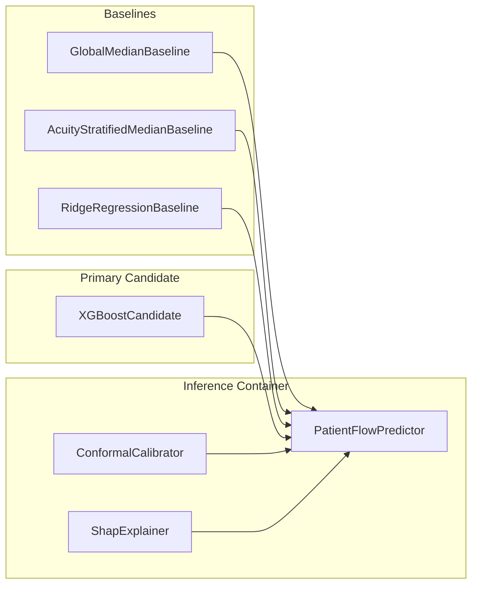

# QueueMind Model Card

Following the Model Cards for Model Reporting framework (Mitchell et al., 2019), this document provides transparent documentation of QueueMind's machine learning architecture, intended applications, ethical considerations, and clinical boundaries.

---

## 1. Model Details

- **Project**: QueueMind — Emergency Department Patient Flow Intelligence System
- **Developer**: QueueMind Open Source Contributors
- **Model Type**: Supervised tabular gradient boosted regression (`XGBoostRegressor`) alongside comparative baselines (`GlobalMedianBaseline`, `AcuityStratifiedMedianBaseline`, `RidgeRegressionBaseline`)
- **Version**: 0.2.0 (Step 4: Explainability & Prediction Uncertainty Foundation)
- **Primary Inputs**: Point-in-time patient demographics, triage acuity, snapshot-safe vitals, abnormal physiological indicators, calendar/cyclical time encodings, and departmental congestion pressures
- **Primary Outputs**:
  - Estimated remaining patient ED duration (`predicted_remaining_time_minutes`: non-negative float)
  - Calibrated prediction intervals (`prediction_interval`: `lower_minutes`, `upper_minutes`, `coverage_level`, `method: split_conformal`)
  - Local feature attributions (`explanation`: `base_value`, ranked `features` with attributions and direction)
- **Explainability**: TreeSHAP feature attributions with human-readable feature aggregation
- **Artifact Serialization**: Containerized in `PatientFlowPredictor` with model weights, input contract schema, version metadata, and optional conformal calibrator / SHAP explainer

---

## 2. Intended Use

### 2.1 In-Scope Operational Applications
- **Operational Decision Support**: Assisting ED charge nurses, flow coordinators, bed managers, and transfer coordinators to anticipate operational bottlenecks.
- **Queue Congestion Mitigation**: Anticipating patient departure timing to plan room turnover, inpatient bed requests, and staffing allocations.
- **Uncertainty-Aware Planning**: Utilizing conformal prediction intervals (e.g. 80%, 90%, 95% coverage) to plan bed buffers under peak operational volatility.
- **Interpretable Factor Auditing**: Examining top operational and clinical contributors to predicted stay duration via TreeSHAP.
- **Subgroup Parity Monitoring**: Evaluating flow and coverage disparities across nursing shifts, triage acuity levels, and patient arrival transport modes.

### 2.2 Out-of-Scope & Prohibited Clinical Applications
> [!CAUTION]
> **Strict Clinical Non-Goal & Safety Disclaimer:**
> - QueueMind is **NOT** a clinical diagnostic tool or medical device.
> - It does **NOT** diagnose diseases, recommend medications, evaluate treatment efficacy, or alter clinical triage scores.
> - Predictions must **NEVER** be used to prioritize, withhold, delay, or ration medical care.
> - QueueMind predicts **total remaining operational journey duration**; it does **NOT** predict or represent doctor-to-bedside waiting times.
> - SHAP explanations represent mathematical model sensitivities; they must **NEVER** be interpreted as causal clinical explanations or medical rationales.

---

## 3. Model Input Contract

The candidate model accepts strictly snapshot-safe features ($t_{\text{event}} \le T_{\text{snapshot}}$):

### 3.1 Numeric Features
- `age`: Patient age in years $[18, 120]$.
- `acuity`: Triage Emergency Severity Index $[1, 5]$.
- `heartrate`, `sbp`, `dbp`, `resprate`, `o2sat`, `temperature`, `pain_numeric`: Latest snapshot-safe physiological vitals (subject to biological plausibility filtering; missing values handled natively by XGBoost tree routing).
- `is_tachycardic`, `is_bradycardic`, `is_febrile`, `is_hypotensive`, `is_hypertensive`, `is_tachypneic`, `is_hypoxic`: Clinical abnormality indicators.
- `vitals_count`, `elapsed_time_minutes`: Longitudinal count of vital assessments and time elapsed since registration.
- `snapshot_hour`, `snapshot_dayofweek`, `snapshot_day`, `snapshot_month`, `snapshot_is_weekend`: Calendar features.
- `hour_sin`, `hour_cos`: Continuous cyclical encodings of time of day.
- `active_census`: Active patient count in ED at snapshot time.
- `arrivals_last_15m`, `arrivals_last_30m`, `arrivals_last_60m`, `arrivals_last_120m`: Rolling arrival counts.
- `departures_last_15m`, `departures_last_30m`, `departures_last_60m`, `departures_last_120m`: Rolling historical departure counts.
- `net_flow_60m`, `flow_velocity_ratio_60m`, `acuity_pressure_index`: Queue velocity and department acuity stress metrics.

### 3.2 Categorical Features
- `gender`: Patient gender (`M`, `F`).
- `arrival_transport`: Mode of arrival (`AMBULANCE`, `WALK IN`, `HELICOPTER`, `UNKNOWN`).
- `chiefcomplaint_category`: High-level clinical presentation category.
- `nursing_shift`: Operational shift bucket (`morning`, `evening`, `night`).

### 3.3 Target Variable & Prohibited Fields
- **Target**: `remaining_time_minutes = (outtime - snapshot_time).total_seconds() / 60.0`.
- **Prohibited Variables**: `stay_id`, `snapshot_time`, `intime`, `outtime`, `disposition`, `remaining_time_minutes`. Prohibited fields are strictly barred from entering feature matrices.

---

## 4. Training, Calibration & Partitioning Methodology

### 4.1 Chronological Splitting Strategy
Random splits and random k-fold cross-validation are strictly prohibited due to co-occupancy temporal leakage. Encounters are sorted chronologically and partitioned:
- **Training Set (70%)**: Historical baseline model fitting.
- **Validation / Calibration Set (15%)**: Split-conformal residual calibration and intermediate early stopping.
- **Holdout Test Set (15%)**: Out-of-sample forward evaluation.
- **Mathematical Guarantee**:
  $$\max(T_{\text{train}}) \le \min(T_{\text{val}}) \le \max(T_{\text{val}}) \le \min(T_{\text{test}})$$

### 4.2 Split-Conformal Calibration Strategy
- Absolute residuals $R_i = |y_i - \hat{y}_i|$ are computed strictly across validation set encounters.
- Finite-sample quantile cutoffs are derived from calibration residuals.
- The holdout test set remains completely untouched during calibration.

---

## 5. Model Architecture & Benchmarking Ladder

1. **`GlobalMedianBaseline`**: Predicts $\text{Median}(Y_{\text{train}})$.
2. **`AcuityStratifiedMedianBaseline`**: Predicts $\text{Median}(Y_{\text{train}} \mid \text{acuity})$ with fallback to global median for missing or unseen acuity.
3. **`RidgeRegressionBaseline`**: Linear regularized model ($\alpha=1.0$) with median imputation, standard scaling, and one-hot encoding.
4. **`XGBoostCandidate`**: Production gradient boosted regression trees (`n_estimators=100`, `max_depth=5`, `learning_rate=0.05`, `subsample=0.8`, `colsample_bytree=0.8`, `random_state=42`) with native NaN handling and zero-floor prediction clipping ($\hat{Y} \ge 0$).
5. **`ShapExplainer`**: TreeSHAP feature attributions aggregating one-hot dummies to original clinical covariates.
6. **`ConformalIntervalCalibrator`**: Split-conformal calibration producing uncertainty intervals $[\max(0, \hat{y} - q), \hat{y} + q]$.

---

## 6. Evaluation Framework & Subgroup Auditing

### 6.1 Point Prediction Regression Metrics
- **Mean Absolute Error (MAE)**: Primary operational currency in minutes.
- **Root Mean Squared Error (RMSE)**: Penalizes severe outlier errors.
- **Median Absolute Error (MedAE)**: Robust metric mitigating extreme boarding outliers.
- **Coefficient of Determination ($R^2$)**: Variance explained.

### 6.2 Uncertainty Evaluation Metrics (`evaluate_prediction_intervals`)
- **Empirical Coverage**: Proportion of test observations falling within predicted bounds:
  $$\text{Coverage} = \frac{1}{N} \sum_{i=1}^N \mathbb{I}(y_i \in [\text{lower}_i, \text{upper}_i])$$
- **Mean Interval Width**: Average spread $(\text{upper} - \text{lower})$ in minutes.
- **Median Interval Width**: Median spread mitigating extreme tail intervals.

### 6.3 Subgroup Evaluation Plan (`evaluate_subgroups` & `evaluate_interval_subgroups`)
Systematic audits partition test performance across:
- **Triage Acuity** (ESI 1 through 5): Verifying error distribution and interval coverage across critical vs non-urgent presentations.
- **Nursing Shifts** (Morning, Evening, Night): Ensuring reliability during high-stress night transitions.
- **Arrival Transport** (Ambulance vs Walk-In): Auditing disparity between stretcher boarding vs waiting-room flow.

---

## 7. Performance Benchmarks

> [!NOTE]
> In adherence to project integrity policies, no synthetic healthcare data or fabricated test metrics are reported. Official benchmark figures will be generated upon executing the pipeline against authorized MIMIC-IV-ED data downloads.

| Model | MAE (mins) | RMSE (mins) | MedAE (mins) | 90% Coverage (%) | Mean Width (mins) | Status |
|---|---|---|---|---|---|---|
| **Global Median Baseline** | *Pending Real Run* | *Pending Real Run* | *Pending Real Run* | N/A | N/A | Scaffolded & Verified |
| **Acuity-Stratified Median Baseline** | *Pending Real Run* | *Pending Real Run* | *Pending Real Run* | N/A | N/A | Scaffolded & Verified |
| **Ridge Regression Baseline** | *Pending Real Run* | *Pending Real Run* | *Pending Real Run* | N/A | N/A | Scaffolded & Verified |
| **XGBoost Candidate + Conformal** | *Pending Real Run* | *Pending Real Run* | *Pending Real Run* | *Pending Real Run* | *Pending Real Run* | Scaffolded & Verified |

---

## 8. Ethical Considerations, Interpretability & Safety Safeguards

1. **Non-Causal Interpretability**: SHAP explanations describe mathematical correlations in retrospective data. Hospital staff must never assume that changing a feature (e.g. attempting to artificially reduce `active_census`) will causally reduce an individual's waiting duration.
2. **Coverage Guarantees vs. Individual Certainty**: Conformal prediction guarantees marginal statistical coverage across a population of exchangeable patient visits. It does not provide subjective individual certainty for an individual patient.
3. **Distribution Shifts**: Sudden shifts in ED operations (mass-casualty events, ambulance diversions, pandemic waves, or severe nurse strikes) violate exchangeability and will degrade prediction interval coverage until recalibrated.
4. **Physician Discretion**: Flow predictions must inform administrative and logistical decisions only. Bed allocations and triage decisions must prioritize clinical judgment over predicted departure time.
5. **Single-Center Caveat**: MIMIC-IV-ED reflects Beth Israel Deaconess Medical Center operational practices; cross-center deployment requires local recalibration.

---

## 9. Department Congestion Forecasting Model Specifications

### 9.1 Model Architecture & Targets
- **Model Type**: Direct Multi-Horizon Regressors (`LastValueCongestionBaseline`, `TimeOfDayMedianCongestionBaseline`, `RidgeCongestionModel`, `XGBoostCongestionModel`).
- **Container**: `CongestionPredictor` serializable with `joblib`.
- **Target**: Physical Active ED Census ($T_{\text{in}} \le T+h < T_{\text{out}}$) at forward horizons:
  - $+30\text{ minutes}$ (`target_census_30m`)
  - $+60\text{ minutes}$ (`target_census_60m`)
  - $+120\text{ minutes}$ (`target_census_120m`)
- **Evaluation Unit**: Reported in **patients** (headcount), evaluated separately per horizon: MAE (patients), RMSE (patients), MedAE (patients), $R^2$.

### 9.2 Intended Operational Use
- **Situational Awareness**: Providing charge nurses and bed managers with forecasted headcount across 30m, 60m, and 120m tactical planning windows.
- **Queue Surge Detection**: Triggering operational alerts when predicted census or net accumulation indicates incoming bottleneck conditions.

### 9.3 Non-Clinical Scope & Disclaimers
- Congestion forecasts predict aggregate departmental patient headcount. They do not predict clinical disease progression, individual vital deterioration, or medical urgency.
- Operational bottleneck indicators (rising velocity, high intake pressure, low departure throughput) reflect queue dynamics and discharge flow rates, not clinical staff quality or care appropriateness.

### 9.4 Multi-Horizon Benchmark Table

| Horizon | Persistence MAE (Patients) | Time-of-Day MAE (Patients) | Ridge MAE (Patients) | XGBoost MAE (Patients) | Status |
|:---:|:---:|:---:|:---:|:---:|:---:|
| **30m** | *Pending Real Run* | *Pending Real Run* | *Pending Real Run* | *Pending Real Run* | Scaffolded & Verified |
| **60m** | *Pending Real Run* | *Pending Real Run* | *Pending Real Run* | *Pending Real Run* | Scaffolded & Verified |
| **120m** | *Pending Real Run* | *Pending Real Run* | *Pending Real Run* | *Pending Real Run* | Scaffolded & Verified |

---

## 10. Operational Simulation & What-If Engine Specifications

### 10.1 Module Architecture
- **Location**: `src/queuemind/queue_health/` and `src/queuemind/simulation/`.
- **Primary Contracts**:
  - `calculate_queue_health_score`: Computes composite operational health score (0–100), state (`HEALTHY`, `MODERATE`, `BUSY`, `CRITICAL`), and dominant pressure driver.
  - `simulate_discharge_acceleration`: Models $+X\%$ throughput improvement.
  - `simulate_capacity_reduction`: Models constrained bed limits and overflow.
  - `simulate_arrival_surge`: Models sudden influx shocks ($+N$ patients).
  - `evaluate_queue_stability`: Evaluates queue momentum (`STABLE`, `STRAINED`, `UNSTABLE`).

### 10.2 Intended Operational Use
- **Administrative Decision Support**: Enabling ED managers to evaluate the quantitative impact of operational adjustments before implementation.
- **Surge Preparedness**: Modeling absorption dynamics for ambulance diversions or mass casualty presentations.

### 10.3 Non-Causal Boundary & Scientific Disclaimers
- **Observational Limitations**: MIMIC-IV-ED lacks interventional counterfactual timestamps. Counterfactual waiting times cannot be causally guaranteed.
- **Explicit Payload Contract**: All simulation outputs include `waiting_time_impact: {"status": "unavailable"}` explaining the causal boundary to prevent clinical misinterpretation.
- **Physical Clamping**: Census trajectories are lower-bounded at $0.0$, strictly adhering to conservation of mass.

